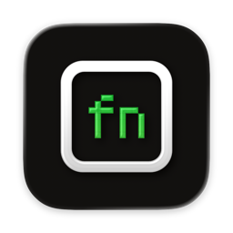

<div align="center">
  <br>
  
  <h1>MCKeyFix</h1>
  <sub>A MacBook keyboard that behaves in Minecraft</sub>
  <br>
  <br>
</div>

MCKeyFix is a tiny macOS menu bar app for playing Minecraft (Java Edition) on a MacBook's built-in keyboard. While you're in-game it turns fn into a sprint key, makes the F-keys work without fn, and turns off the Control shortcuts that keep switching your input source or Space mid-fight. When you pause, open a menu or switch apps, everything goes back to normal.

- 🏃 **fn/🌐 → Left Control** on the internal keyboard only, so fn is sprint and the Globe key can't switch input sources
- ⌨️ **F1–F12 as real function keys**, so F3, F5 and the rest work without holding fn
- 🚫 **^Space, ^⌥Space, ^1–9 and ^←/^→ disabled**, so sprint + jump or a hotbar key doesn't switch input source or Space
- 🎮 Only active while the game has captured the mouse. Inventories, chat and the pause menu are left alone.
- 🛟 Never switches while fn/Control is held, and restores your settings on the next launch if it ever crashes
- 🔒 Needs no permissions. It watches mouse movement, never keystrokes.

Developed and tested on macOS 27 with the built-in keyboard of an Apple silicon MacBook. External keyboards are not touched.

## Install

You need macOS 11 or later.

```sh
brew install gergogyulai/tap/mckeyfix
```

<details>
<summary>Without Homebrew</summary>

Download the zip from the [latest release](https://github.com/gergogyulai/mckeyfix/releases/latest), unzip it and move MCKeyFix.app to Applications.

MCKeyFix isn't notarized, because that needs a paid Apple developer account. The first launch is blocked with a warning that Apple can't check the app for malware. To allow it, open **System Settings → Privacy & Security**, scroll down and click **Open Anyway**. You can also clear the flag from a terminal:

```sh
xattr -dr com.apple.quarantine /Applications/MCKeyFix.app
```
</details>

It lives in the menu bar only, with no Dock icon. The game controller icon fills in while the fixes are active. To start it automatically, add it under **System Settings → General → Login Items**.

### Build from source

You need Xcode 26 or later (for `actool` to compile the Icon Composer icon).

```sh
git clone https://github.com/gergogyulai/mckeyfix.git
cd mckeyfix
./scripts/build-app.sh          # → build/MCKeyFix.app (ad-hoc signed)
open build/MCKeyFix.app
```

`UNIVERSAL=1` builds for Intel too. `SIGN_IDENTITY="<name>"` signs with a keychain identity instead of ad-hoc.

## How it works

| Piece | How |
|---|---|
| finding Minecraft | Minecraft Java runs as a `java` process whose arguments mention `minecraft`. The launcher is ignored. |
| in-game detection | When the game captures the mouse, mouse events keep arriving but the cursor stops moving. A few in a row means you're playing; normal movement means a menu. |
| fn and F-keys | `hidutil` sets `UserKeyMapping` (matched to the built-in keyboard) and `HIDFKeyMode` |
| shortcuts | Toggled with the private SkyLight call `CGSSetSymbolicHotKeyEnabled` |

### Caveats

- The shortcut toggling uses a private macOS API, so a future macOS update could break it.
- Any `hidutil` `UserKeyMapping` of your own on the internal keyboard is cleared when MCKeyFix deactivates.

## Project Structure

```
mckeyfix/
├── main.swift                  # the whole app: detection, remapping, menu bar item
├── mckeyfix.icon/              # Icon Composer document
├── assets/                     # README images
├── scripts/
│   └── build-app.sh            # builds and signs the .app
├── packaging/homebrew/         # cask template, published to gergogyulai/homebrew-tap on release
└── .github/workflows/          # tag → GitHub release + cask update
```

## Contribute

This is a personal project, built in the open. Ideas, issues, and PRs are welcome.

## Credits

Not affiliated with Mojang or Microsoft.

## License

[MIT](LICENSE)
